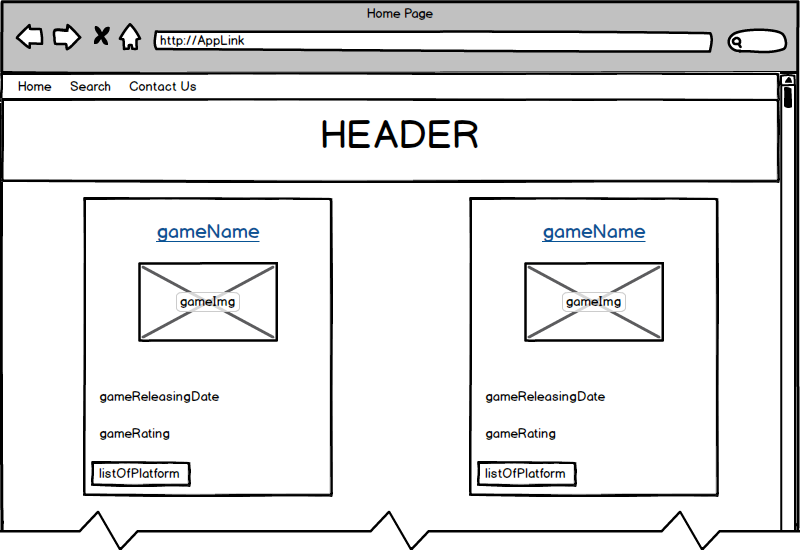
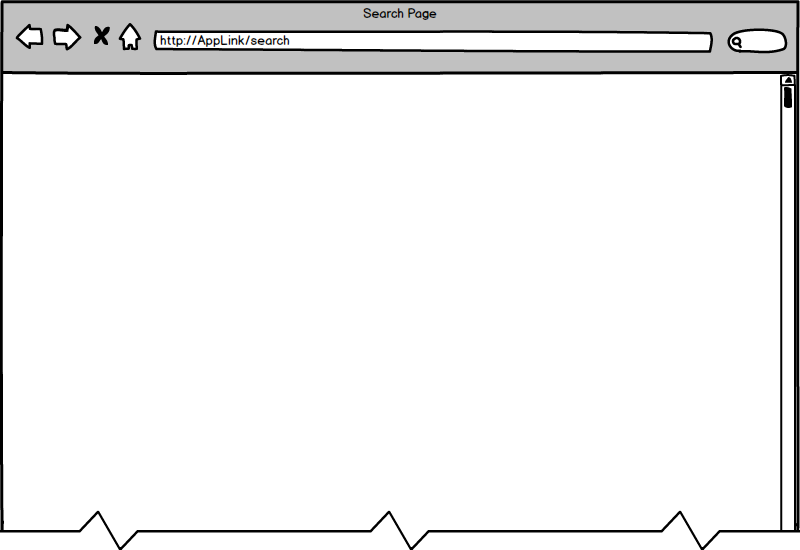

# GG
## Introduction:
The GG it is about displaying games informations.

---
## List of used technologies:
* Visual Studio Code.
* HTML / CSS / JS.
* React.
* jQuery.
* Bootstrap.
* JSX.
* Components.
---
## User experience:
User can navigate the website and search for games.
---
## Wireframes:
HOME Page

SEARCH Page

CONTACT Page

---
## Done by:
* AMIGOS TEAM
1. Abdurrahman Al-Sulamy (Team Leader).
2. Sara Al-Raddadi.
3. Fatmah Kelntan.
4. Faisal Al-Sulaimani.
---
## Acknowledgments:
GG project was developed while taking GA | MiSK Academy ( Software Engineering Immersive Course ) at Effat University.
